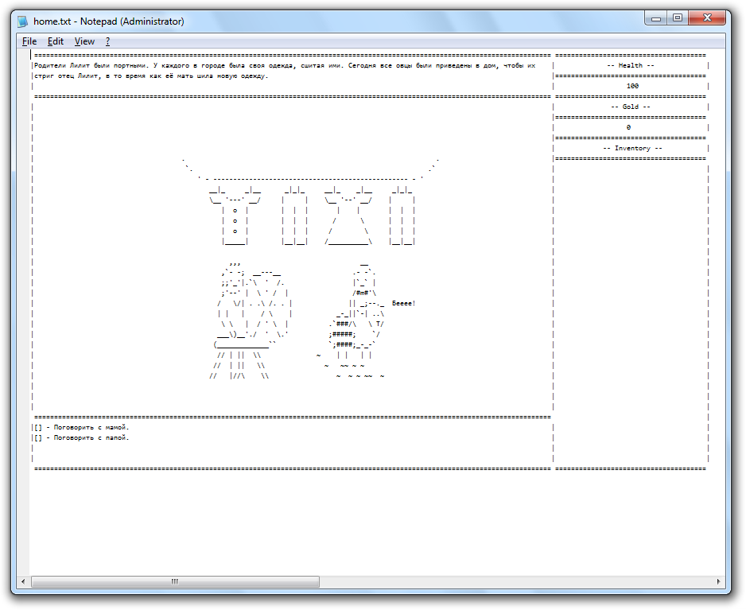

# И все же было больно - игра в блокноте.

Актуальная версия игры https://github.com/LencoDigitexer/and-yet-it-hurt/releases/tag/2.0  

<b>Как начать играть?</b>
1. https://github.com/LencoDigitexer/and-yet-it-hurt
2. Там будет кнопка скачать. Либо скачайте этот zip https://github.com/LencoDigitexer/and-yet-it-hurt/releases/download/2.0/and_yet_it_hurt.zip
3. Распакуйте все файлы в папку и запустите and_yet_it_hurt.exe.
4. Когда вы начнете игру, откроются следующие три вещи:  
    <b>Блокнот, окно консоли и определенная папка в проводнике файлов</b>
     
     
<b>Как играть?</b>
 
1. дело в том, что в игре пока можно играть за женских персонажей из-за трудностей перевода. Поэтому рекомендую использовать параметр « Я никак не могу определиться с именем» и «she/her/her» и использовать предложенные женские имена
2. Быть первым российским игроком and yet it hurt

# Для разработчиков

Исходный код игры для блокнота с переводом текста на русском языке.
Переведено на 95%...
Основная проблема перевода скриптов lua - кодировка:
> github не умеет "правильно" отображать windows1251, вместо этого видим кракозябры, но умеет в UTF-8

> интерпритатор скриптов Lua - LOVE ругается на UTF-8, но требует windows1251

Поэтому для запуска исходников, надо переконвертировать все скрипты в windows1251.

Основная, тоже немаловажная, проблема - трудности перевода.
> Дело в том, что в английском языке глаголы не имеют пола, а в русском - да. Поэтому пришлось оставить только женских персонажей в игру(вы все прекрасно понимаете почему), благо, я нашел имена девушек, которые даже в русском виде не имеют склонений (Кроу, Бэтти), но если пользователь захочет ввести свое имя, то оно останется неизменным, хотя в английском все проще - просто добавить окончание 's.

* [Играть в игру на английском языке](https://sheepolution.itch.io/and-yet-it-hurt)
* [Посмотреть трэйлер на английском языке](https://www.youtube.com/watch?v=qcdMVoE4mJM)
* [Read about how the game was made](https://sheepolution.com/blog/gamedev/how-i-made-a-game-played-in-notepad/)
* [Узнать, как я сделал эту игру](https://habr.com/ru/company/playgendary/blog/488222/)
